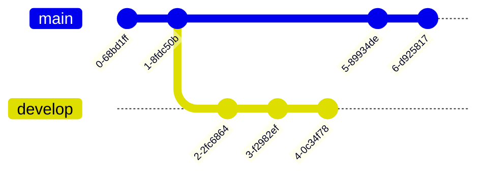

# Capstone project at Innopolis University

This is a repo of the [Capstone project at the Innopolis University](https://capstone.innopolis.university/) - <https://capstone.innopolis.university/>

Table of contents

- [Capstone project at Innopolis University](#capstone-project-at-innopolis-university)
  - [Setup](#setup)
  - [Run the website locally](#run-the-website-locally)
  - [Contribution rules](#contribution-rules)
  - [Git essentials (for beginners)](#git-essentials-for-beginners)
  - [Pull requests](#pull-requests)
  - [Shortcodes](#shortcodes)
    - [LaTeX](#latex)
    - [Mermaid (graphs)](#mermaid-graphs)
    - [Other shortcodes](#other-shortcodes)

## Setup

Throughout the project, you will be required to write progress reports. These reports will be published on the [Capstone project website](https://capstone.innopolis.university/). To contribute to the website, you will need to follow these steps:

1. One of the team member (e.g. `john5000`) should fork this repository under the name of the team (e.g. `dream-team`). This will create a copy of the repository under the name `john5000/dream-team`.

2. Install latest version of [Hugo](https://gohugo.io/getting-started/installing/) on your local machine. Also, make sure you have a code editor installed. [VSCode](https://code.visualstudio.com/) is recommended, but you may use the one you prefer.

3. Clone the forked repository **with submodules** to your local machine using

```bash
git clone --recursive https://github.com/john5000/dream-team
```

## Run the website locally

To start the website localy, run

```bash
hugo server --minify --theme=hugo-book
```

The last line in the terminal output should look like

```bash
Web Server is available at http://localhost:port/ (by default: http://localhost:1313/)
```

Visit `http://localhost:port` in your browser to access your local instance of the website. Now all of you changes in the website's source code should be propagated automatically.

## Contribution rules

We set up a few rules to make the contribution process as smooth as possible:

1. When you firstly clone the repository, you should create a folder with your group name (same as the name of the forked repository e.g. `dream-team`) in both `content/docs/$YEAR/` and `static/$YEAR/` (e.g. `content/docs/2024/dream-team` and `static/2024/dream-team`). This is where you will store your progress reports and static content respectively. Note, that if you modify any other files, **you will not pass the CI/CD pipeline** and your changes will not be merged.

2. For each progress report you will have to create respective markdown file (e.g. `content/docs/2024/dream-team/week1.md`).
3. You should create `_index.md` file in your group folder (e.g. `content/docs/2024/dream-team/_index.md`) with the following content:

```md
---
bookCollapseSection: true
title: "Dream Team"
---
```

## Git essentials (for beginners)

After you feel you have made enough changes, run

```bash
git add .
```

to [stage all changes](https://git-scm.com/docs/git-add), then

```bash
git commit -m "Your very informative progress report that describes the changes you've made"
```

to [commit your changes](https://git-scm.com/docs/git-commit) to the local repository. Finally, run

```bash
git push
```

to [push your changes](https://git-scm.com/docs/git-push) to the remote repository or

```bash
git push --set-upstream origin your-branch-name
```

if you are pushing for the first time.

## Pull requests

Now that you have made your changes, you will need to properly submit them so that no merge conflicts happen.

**Instructions to merge your branch with the master branch**

It should push the branch normally. If not, send the error to the group.
Make sure to run [`git pull`](https://git-scm.com/docs/git-pull) before you make any new changes after you've pushed, so that you avoid creating merge conflicts.

- Now go to the [github repo](https://github.com/IU-Capstone-Project-2024/reports)
- Press ["Pull requests"](https://github.com/IU-Capstone-Project-2024/reports/pulls)
- Press ["New pull requests"](https://github.com/IU-Capstone-Project-2024/reports/compare)
- Press "Create pull request"
- Name your pull request in a format `My_Cool_Project_Group_Name (Week X): Very short description`
- Describe what have you modified, maybe provide some suggestions for future improvements
- Once done, press "Create pull request"
- Done! Admins will review your work and merge your changes into the main repo soon

## Shortcodes

This blog template uses a handful of shortcodes. Shortcode *(in a nutshell)* is "mark" inside your markdown code that enables certain features within its code block. For example, you can define a codeblock of LaTeX code that renders LaTeX formulas. You can also define a codeblock that describes a structure of a graph. Below are example of these two.

### LaTeX

How to write in LaTeX:

```md

your latex formula

```

This produces an inline formula. If you want to center your formula, use `display` property like so:

```md

your centered latex formula

```

[Latex cheatsheet](https://wch.github.io/latexsheet/latexsheet.pdf)

### Mermaid (graphs)

How to create graphs:

1. [Take a look at Mermaid syntax](https://mermaid.js.org/intro/)
2. Pick a graph you want to use
3. Write necessary code

**Ex:**

```md

gitGraph
  commit
  commit
  branch develop
  commit
  commit
  commit
  checkout main
  commit
  commit

```

will be rendered as



Refer to [Mermaid documentation](https://mermaid.js.org/intro/) for examples.

### PDF embedding

To embed a PDF file, use the following shortcode:

```md

```

### Other shortcodes

This project's shortcodes and their descriptions can be found in `layouts/shortcodes`. They all use the same syntax:

```

...stuff/..

```

Try them out if you think they are useful in your progress reports.