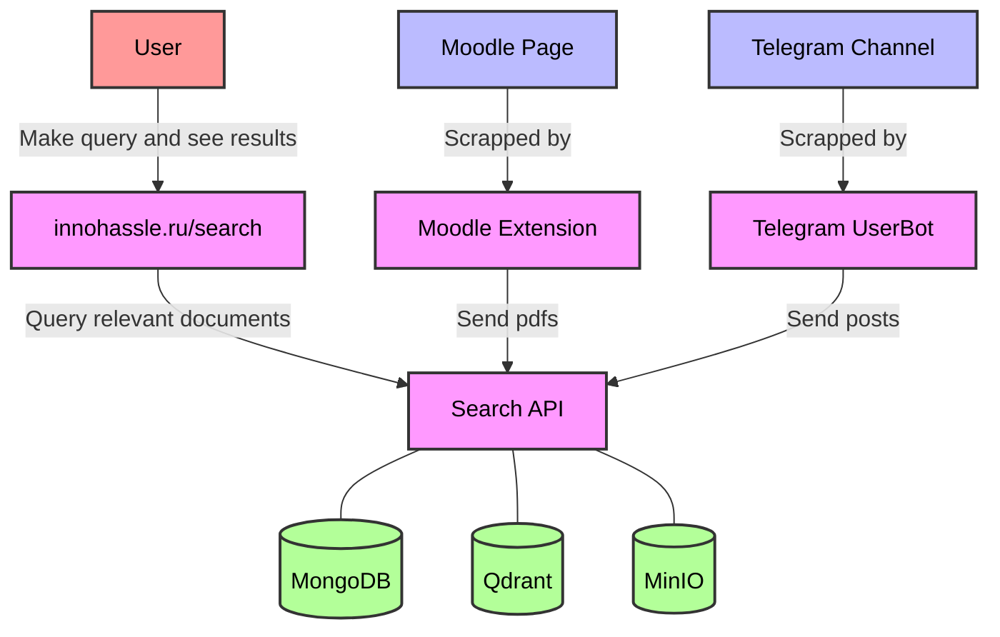
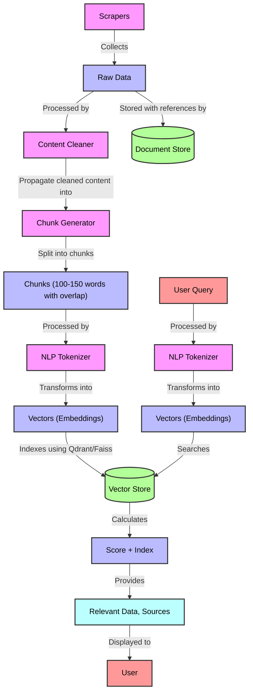

# Find anything you want in Innopolis



[innohassle.ru / search](https://innohassle.ru/search)

# Week 1 - Project Proposal

## Team Formation and Project Proposal

### Team Members

| Team Member          | Telegram ID                                    | Email Address                       |
|----------------------|------------------------------------------------|-------------------------------------|
| Ruslan Belkov (Lead) | [@dantetemplar](https://t.me/dantetemplar)     | r.belkov@innopolis.university       |
| Artem Bulgakov       | [@ArtemSBulgakov](https://t.me/ArtemSBulgakov) | art.bulgakov@innopolis.university   |
| Anatoly Soldatov     | [@podyapolskiyaa](https://t.me/podyapolskiyaa) | a.soldatov@innopolis.university     |
| Alyona Artemeva      | [@Art_libra](https://t.me/Art_libra)           | a.artemeva@innopolis.university     |
| Eldar Mametov        | [@eldarlek](https://t.me/eldarlek)             | e.mametov@innopolis.university      |
| Nikita Sannikov      | [@raydenoir](https://t.me/raydenoir)           | n.sannikov@innopolis.university     |
| Amir Gubaidullin     | [@mng_cry](https://t.me/mng_cry)               | am.gubaidullin@innopolis.university |

### Value Proposition

- **Identify the Problem:**
  University students often face significant difficulties in finding the necessary information. Disparate information
  sources, complex search systems, and the lack of a centralized access point make the process of information retrieval
  lengthy, labor-intensive, and frustrating. Frequently, students abandon their search without finding the needed
  information.
- **Solution Description:**
  A centralized portal providing students and university staff with access to a wide range of information in one
  convenient location. This solution addresses data fragmentation, simplifies information search, and enhances learning
  efficiency.

  For Innopolis University, the following information sources may be consolidated:

  **University:**

    - Lecture materials
    - University documents
    - Eduwiki
    - Campus life
    - University events (Opportunities channel)
    - Dormitory documents
    - Professors and courses
    - Room booking information (Outlook)
    - Sports sections (descriptions, channels, events)

  **City:**

    - List of residents
    - City organizations
- **Benefits to Users:**
    - Access to the necessary information when needed.
    - Quick and efficient information retrieval.
    - A user-friendly interface providing information in one place.
- **Differentiation:**
  Our competitors include Moodle and Eduwiki (as information sources) and search engines like Yandex.

  Advantage: Fine-tuning the solution for Innopolis University (or other organizations).

- **User Impact:**
  Increased productivity and learning efficiency through easy access to required information.
- **User Testimonials or Use Cases:**
    - **Academic Support:** Student Ivan uses the platform to quickly find lecture materials and prepare for exams,
      significantly saving time.
    - **Event Organization:** Student Anna easily finds information about upcoming seminars and workshops, aiding her
      participation in additional educational activities.
    - **Dormitory Life:** Student Maxim accesses all necessary documents and instructions for dormitory living through
      the platform, eliminating the need for administrative visits.
    - **Sports Sections:** Student Olga finds training schedules and events for sports sections, helping her balance
      studies and physical activity.
    - **City Information:** International student John uses the platform to find information about city institutions and
      services, aiding his adaptation to the new environment.
    - **Room Booking:** Student Artem uses the platform to book rooms for study sessions and project meetings,
      simplifying the organization of academic activities.

## Lean Questionnaire

1. **What problem or need does your software project address?**
   The need for a unified resource for searching information related to life and activities in the city of Innopolis.
   Students and university staff face challenges in effectively finding information within the university, including:
    - Lecture materials
    - University documents
    - Campus events
    - Living information
    - Sports events
    - City resources
    - Information about professors and courses
    - Room booking information
2. **Who are your target users or customers?**
    - **Primary Customers:** Innopolis University or other organizations.
    - **Primary Users:** Students of Innopolis University (or employees of organizations).
    - **Secondary Users:** Professors, administrative staff, and technical writers.
3. **How will you validate and test your assumptions about the project?**
    - **User Interviews:** Conduct interviews with students, professors, and administration to understand their specific
      needs and problems.
    - **Surveys:** Distribute surveys to collect quantitative data on information access and usage patterns.
4. **What metrics will you use to measure the success of your project?Engagement Metrics:**
    - Number of active users
    - Frequency of platform usage
    - Time spent on the platform
    - Average session duration
    - Number of completed searches
    - User feedback on the platform

   **Performance Metrics:**

    - Accuracy and efficiency of search results
    - Performance of AI models
5. **How do you plan to iterate and pivot if necessary based on user feedback?**
    - **User Feedback Loop:** Implement a user feedback system with a feedback form on the site, as well as like and
      dislike buttons to rate the AI responses.

## Leveraging AI, Open-Source, and Experts

- **AI:**
    - Implement AI models at the core of our search and response generation systems.
    - Use ChatGPT and Gemini for ideation and report generation.
    - Employ AI tools like Copilot for efficient coding practices.
- **Open Source:**
    - Utilize permissively licensed open-source libraries to enhance our development process.
    - Research and integrate publicly available solutions to inspire and improve our project.
- **Experts:**
    - Engage with domain experts such as Alexey Potemkin and Albert Nasybullin to guide our project's development and
      ensure alignment with industry standards and best practices.

By thoroughly defining the vision for our project and leveraging modern technologies and expert guidance, we aim to
create a robust, user-friendly platform that significantly enhances the information retrieval experience for the
Innopolis community.

## Overview

The primary objective of our project, InNoHassle, is to develop a centralized portal that aggregates various services
within the Innopolis ecosystem, providing a seamless user experience for students and staff. The key motivation behind
this project is to address the frequent challenges students face in finding relevant information efficiently. Our
solution aims to streamline access to diverse resources such as lecture materials, university documents, event
schedules, and more, by integrating them into a single, user-friendly interface.

The main functionalities of our project include:

- **Search Portal:** A dedicated webpage featuring an intuitive search form that allows users to query various
  information systems, such as Moodle, for relevant academic materials and resources.
    - A clean and intuitive user interface for the search form.
    - Users can input queries to search across various integrated systems such as Moodle.
    - The search results will include a brief overview of the topic, relevant information snippets, and corresponding
      references.
- **Response Generation:** Using a Retrieval-Augmented Generation (RAG)-based approach to provide concise summaries and
  references for the searched topics.
    - Utilize a RAG-based approach to generate comprehensive and relevant responses.
    - The system will fetch information from indexed data sources and provide summaries enhanced by AI models.
- **Feedback Mechanism:** Implementing features for users to provide feedback on the relevance and accuracy of the
  search results through likes and dislikes.
    - Incorporate like and dislike buttons for users to rate the relevance and accuracy of the provided search results.
    - Collect user feedback to continuously improve the AI models and search algorithms.
- **Enhanced Parsers:** Improving existing parsers to efficiently gather and index information from multiple sources.
    - Develop and refine parsers to aggregate data from various sources efficiently.
    - Ensure that all collected data is properly indexed with appropriate tags, categories, and metadata.
- **Data Integration:** Negotiating access to essential data sources such as Moodle, and systematically indexing data
  entities with tags, categories, sources, and relationships.
    - Collaborate with key stakeholders, including Alexey Potemkin, to negotiate access to crucial data sources like
      Moodle.
    - Implement a robust indexing system to organize and relate data entities, facilitating efficient search operations.

**Search Pipeline Diagram:**

**Existing Architecture of InNoHassle Events service:**

## Tech Stack

To ensure scalability, performance, and ease of development, we have carefully selected the following technologies,
frameworks, and programming languages for our project:

**Backend:**

- **Python:** For its simplicity and extensive libraries for data processing and machine learning.
- **FastAPI:** A modern, fast (high-performance) web framework for building APIs with Python 3.6+ based on standard
  Python type hints.
- **Langchain, Ollama:** To implement the Retrieval-Augmented Generation (RAG) pipeline for generating search results.
- **MongoDB:** As our database solutions to efficiently store and manage data from various data sources (schema-less)
- **Qdrant:** Vector database to store embedded information for content-meaningful search.

**Frontend:**

- **TypeScript:** A strongly typed programming language that builds on JavaScript, providing better tooling at any
  scale.
- **React, Next.js:** For building dynamic and high-performance user interfaces and server-side rendering capabilities.
- **TailwindCSS:** A utility-first CSS framework for rapid UI development with consistent and responsive design.

# Week 2 - Choosing the Tech Stack, Designing the Architecture

## Tech Stack Selection

**Frontend:** React, Next.js, TailwindCSS, React PDF.

**Backend:** FastAPI, MongoDB & Beanie, Qdrant | FAISS, MinIO

**ML:** Embeddings (TBD), langchain, Ollama(llama3)

## Architecture Design

### Overview Schema

### NLP Search Pipeline Schema

1. **Component Breakdown**:
    1. **ASGI API app**. The ASGI (Asynchronous Server Gateway Interface) API application forms the core of the backend
       infrastructure for your project, facilitating efficient and scalable web service development tailored to handle
       asynchronous operations and high concurrency demands. This component's responsibilities and design are critical
       as it directly impacts both the performance and maintainability of the system. Technologies: FastAPI, MongoDB &
       Beanie, Qdrant | FAISS, MinIO. Below is a breakdown of functionality:
        - **API Endpoints:** Handle HTTP requests from the frontend and scrappers, processing them to perform actions
          like search queries, data retrieval, and data storage. This includes CRUD operations, authentication
          processes, and any other interactive functionality required by the client-side applications.
        - **Business Logic Implementation:** Encompasses the core algorithms and data processing logic that dictate how
          data is handled, manipulated, and provided back to the client. This is where the rules and procedures for data
          management and query processing are encoded.
        - **Database Interactions:** Manages all interactions with databases and data storage solutions, ensuring data
          integrity, efficiency in data retrieval and storage, and proper synchronization of data across different
          storage systems.
        - **Data Flow Management:** Coordinates the flow of data across various components of the system, such as
          between the API and the databases, or from the scraping tools to the storage and indexing services.
    2. **Website. [innohassle.ru](http://innohassle.ru)** The website serves as the primary interface for users to
       interact with the search functionalities provided by the backend. Leveraging React, Next.js, and TailwindCSS, the
       website is designed to be both aesthetically pleasing and highly functional.
    3. **Moodle Extension.** The browser add-on integrated within the Moodle ecosystem, providing functionalities such
       as:
        - **Session Persistence:** Automatically manages user sessions to maintain login states, reducing the friction
          of repeatedly logging in (common issue in Innopolis).
        - **Quick Access to Resources:** Direct links to frequently accessed course materials, assignments, and grades.
        - **Data Extraction:** Ability to scrape and extract documents, announcements, and other course-related
          materials automatically. This data can then be indexed and made searchable via your main site. Very helpful
          for test preparation.
        - **Integration:** Seamlessly integrate with the main site's API to upload and index new documents, facilitating
          real-time data synchronization and enrichment of the search database.
    4. **Telegram Bot.** Designed to scrape content or updates from specific channels or groups, which can then be fed
       into the system for indexing
2. **Data Management**:
    1. **Data Scrappers:** parsers to extract documents from moodle and other sources.
    2. **Data Version Control (DVC):** to track the state of datasets in terms of updating data.
    3. **Data Storage:** MongoDB for metadata, qdrant / faiss for embeddings, MinIO for files itself .
3. **User Interface (UI) Design**:

   Our service is based on the existing InNoHassle ecosysystem, and therefore completely repeats its UI and integrates
   into it. The current solution (InNoHassle) has stood the test of time, during which we have gathered user feedback
   and continuously improved both the UI and UX accordingly. This iterative process has ensured that our design not only
   meets user needs but also enhances overall user experience.

   The design is developed with the primary goal of maximizing ease of interaction for users. We focus on simplicity and
   clarity, ensuring that the interface is intuitive and user-friendly. By adhering to these principles, we aim to
   provide a seamless and efficient experience for all users. The clean and straightforward design helps to minimize
   distractions and allows users to focus on their tasks, contributing to a more satisfying user experience overall.

4. **Integration and APIs**:

   As a result of our meeting, we decided to use the following APIs for project implementation:

    - **Telegram API**: to retrieve information from the necessary Telegram channels.
    - **InNoHassle Accounts**: for user authentication in the developed product.
    - **Moodle API**: to retrieve information from courses.

   We will also use MongoDB, Qdrant, and MinIO databases to store the data necessary for the project implementation:

    - **MongoDB** will be used to store small-volume documents and internal information, such as source links, metadata,
      and more.
    - **Qdrant** is used for indexing documents and ensuring efficient data search.
    - **MinIO** is designed for storing large-size files.
5. **Scalability and Performance**:
    - **React and Next.js:** Utilizing server-side rendering (SSR) and static generation features of Next.js improves
      the initial load time and performance of the web application, crucial for user retention and engagement. The
      component-based architecture of React allows for dynamic loading of content, which can adapt to varying traffic
      conditions by only updating what's necessary.
    - **TailwindCSS:** Since TailwindCSS is a utility-first CSS framework, it allows for significantly smaller CSS
      bundle sizes when purged correctly, which results in faster page render times and improved performance, especially
      important for mobile users.
    - **FastAPI:** Built on Starlette, FastAPI supports asynchronous request handling, which is more efficient on I/O
      operations, allowing your system to handle a large number of simultaneous users without blocking on network
      requests. This is particularly advantageous when dealing with high-latency operations like web scrapings and data
      fetches from external APIs.
    - **MongoDB & Beanie:** MongoDB’s horizontal scalability through sharding enables the database to handle large
      datasets and high throughput operations efficiently. Beanie’s asynchronous operations harness the power of
      Python’s async features to make non-blocking database calls, which helps in maintaining a high performance even
      under load.
    - **Qdrant | FAISS:** Both are designed for scalable similarity search in high-dimensional vector spaces, which is
      key to supporting the efficient querying of large-scale datasets in your application. These systems can scale with
      the data size and complexity of queries, ensuring that search functionalities remain fast and reliable.
    - **Caching:** We familiar with caching mechanisms at different levels (API responses, database queries, static
      content) to reduce the load on the servers and speed up the response time for frequently requested resources.
    - **Load Balancing:** We know about load balancers to distribute incoming network traffic across multiple servers,
      thus ensuring no single server bears too much demand.
    - **Grafana, Grafana Loki and Prometheus:** We utilize Prometheus (thanks to SNA course) for real-time monitoring
      and metrics collection across our services, ensuring detailed visibility into system performance. The metrics
      collected by Prometheus are visualized using Grafana, which provides customizable dashboards for comprehensive
      monitoring. This setup allows us to track performance efficiently and manage system health proactively, with
      integrated alerting mechanisms to detect and resolve issues promptly, ensuring our system remains scalable and
      responsive.
6. **Security and Privacy**:

   At InNoHassle, security and privacy are paramount considerations in our development and deployment processes. Our
   commitment to these principles ensures that user data is protected and our system remains resilient against potential
   threats. We have implemented **InNoHassle-Accounts** for our Identity and Access Management (IAM) pipeline, which
   provides robust authentication and authorization mechanisms. This system supports Innopolis SSO and Telegram Auth,
   ensuring seamless and secure user authentication.

7. **Error Handling and Resilience**:

   Our architecture design focuses on effective error handling and resilience to ensure system stability. We use
   detailed logging and real-time monitoring to quickly identify and address issues. By implementing retries and
   fallbacks, we gracefully handle transient failures to maintain continuous operation. *Testing updates in a staging
   environment on a separate server ensures that changes are thoroughly validated before deployment, minimizing
   potential disruptions and enhancing overall system reliability.* This approach helps us maintain a dependable user
   experience.

8. **Deployment and DevOps**:

   We use Trunk-based development methodology which means we have one main branch, and some short-living branches. For
   each branch we setup CI workflow that checks code quality, code style, runs tests (if any exist). For main branch we
   have CD workflow that builds a Docker image and runs project on our staging server. Then, after checking new features
   in staging environment, we start deployment to production workflow that pushes Docker image to our production server
   and reloads the project on production.

## Week 2 questionnaire:

1. **Tech Stack Resources:**

   We don’t need any project-based books as we have enough experience in our tech stack. We use only libraries
   documentations and some info on Internet as references.

2. **Mentorship Support:**

   We have a person who agreed to help us with ML design and general project pipeline. His name is Albert Nasybullin. As
   our project involves a lot of ML, his guidance on this direction is very useful to us. We believe that the advices he
   gives to us will lead to success of the project.

3. **Exploring Alternative Resources:**

   We invest a significant amount of time exploring various information sources, such as Habr, GitHub, Stack Overflow,
   and more, to analyze existing solutions, stay updated with the latest trends, and efficiently accomplish our tasks.

4. **Identifying Knowledge Gaps:**

   Throughout our project, we continually access our current skill set and recognize areas where we lack expertise. When
   we identify a lack of knowledge in some area, we:

    - Scheduling additional mentorship sessions with Albert Nasybullin to delve deeper into advanced ML topics.
    - Engaging with communities and forums to seek advice and share knowledge with experts in these areas.
    - Reading relevant research papers and articles to stay informed about the latest advancements and best practices.
    - Viewing tutorials and training materials on relevant topics.
5. **Engaging with the Tech Community:**

   We are fortunate to have Albert Nasybullin, an experienced professional, guiding us on ML design and the overall
   project pipeline. His expertise is invaluable given our project's heavy reliance on ML. Additionally, we actively
   engage with fellow students and keep our project open-source, fostering a collaborative environment where we can
   share our progress and gather diverse feedback.

6. **Learning Objectives:**

   We aim to master asynchronous API development with FastAPI to ensure efficient and scalable web services.
   Additionally, we are enhancing our skills in modern frontend frameworks like React and Next.js, and creating
   responsive, user-friendly interfaces with TailwindCSS. In the realm of machine learning, we are focused on
   implementing Retrieval-Augmented Generation using Langchain and Ollama, and working with Qdrant as a vector database.
   Furthermore, we strive to learn full-stack integration, seamlessly connecting backend services with machine learning
   models to deliver a cohesive and functional solution.

7. **Sharing Knowledge with Peers:**

   We hold regular weekly group meetings to share knowledge and experiences with team members, as well as to address
   current issues. At each meeting, we discuss how we could use our skills to implement the project, and share our
   experiences that may help team members achieve their goals by the next meeting. Our team actively uses a Telegram
   group where we communicate daily, share completed work, report emerging problems, and resolve them promptly. Here, we
   also plan future meetings and coordinate efforts so that everyone knows what their colleagues are working on and what
   tasks the entire group faces.

   This well-structured teamwork helps us work cohesively and maintain a high level of efficiency and team cohesion.

8. **Leveraging AI:**

   We use AI. A lot of AI.

## Tech Stack and Team Allocation

### Team Members

| Team Member          | Track    | Responsibilities                                      |
|----------------------|----------|-------------------------------------------------------|
| Ruslan Belkov (Lead) | ML       | Backend                                               | Research and implement NLP search pipeline | Work with storages |
| Anatoly Soldatov     | ML       | Research and implement NLP search pipeline            |
| Eldar Mametov        | Backend  | Develop Telegram userbot to get channel’ post history |
| Nikita Sannikov      | Backend  | Develop API for Search                                |
| Artem Bulgakov       | Frontend | DevOps                                                | Develop browser extension to persist user session and extract data from Moodle | Deploy all services |
| Amir Gubaidullin     | Frontend | Develop Search page                                   |
| Alyona Artemeva      | Frontend | Design                                                | Develop Search page | Propose design vision |

## Weekly Progress Report

- On Monday we had a meeting with Albert Nasybullin (ML expert) regarding the architecture of ML pipeline. He proposed a
  way to collect data, transform data, process user request, and output information.
- On Thursday we had a meeting with Alexey Potyomkin (DoE) regarding the access to Moodle. He said that read-only access
  to all materials on Moodle should be no-problem. But it needs discussion with security guys and some his free time, so
  the access may be granted not so quick.
- Frontend team has created a web page on InNoHassle Website. The page includes basic elements that are needed for
  interaction with user: search input, result cards. Also, they researched solutions to preview PDF files, and
  integrated one of them into website.
- Extension team has created a repository for browser extension development, and researched the ways to develop
  extension. The basic functionality was integrated, such as Moodle API token receiving, background fetching of courses
  list. Extension popup with quick links to courses was also created.
- Backend team has researched ways to collect data from Telegram channels. They wrote a User bot code that fetches posts
  from university channels such as Opportunities for you, Sports in IU. Also, backend created a repository for Search
  API development, and set up CI/CD pipelines with DevOps team.
- ML team has researched ways to do RAG (retrieval augmented generation). They tried some of existing solutions to
  understand RAG better. Also, they prepared a pipeline to pre-process data, such as extraction of text from PDF files (
  it was surprisingly hard, no robust open-source solution).
- All team members were collaborating with each other, as people from other tracks have some knowledge in other tracks.
  Some problems were discussed in our chat, some problems required a meeting.

## Challenges & Solutions

- **Extracting Text from PDFs:** We encountered significant difficulties in extracting clean text from PDF files. We
  tried several libraries including pydfium, pypdf, pypdf2, unstructured, llmsherpa, and pdfplumber, but none provided
  satisfactory results. To address this, Ruslan decided to contribute to the pymupdf library by completely reworking the
  wrapper module named pdf4llm. This custom solution allowed us to achieve the clean text extraction necessary for our
  NLP processing pipeline.
- **Moodle API Integration:** Integrating with Moodle presented challenges due to its complex API, lack of
  documentation, and no fully working open-source libraries. Additionally, the authentication process was somewhat
  intricate. To overcome these issues, Artem researched Moodle's source code to understand how the mobile app interacts
  with the API, allowing us to mimic this behavior effectively and integrate the required functionalities into our
  system.

## Conclusions & Next Steps

### Next Steps:

1. **Refinement of ML Pipeline:**
    - Continue Developing RAG Pipeline
    - Experiment with Langchain and Ollama
2. **Enhancing Backend Functionality:**
    - Implement API Endpoints
    - Expand Telegram Integration
3. **Frontend Development Enhancements:**
    - Implement Advanced Search Features: Develop and integrate features like autocomplete, filters, and sorting options
      on the search page to enhance user experience.
    - Improve Browser Extension Functionality: Add features such as session persistence, real-time data extraction, and
      user-friendly course material navigation.
4. **Data Management and Storage Optimization:**
    - Refine Data Pipeline
    - Integrate Data Version Control (DVC)
5. **Knowledge Sharing:**
    - Continue holding weekly meetings and knowledge-sharing sessions, encouraging team members to discuss challenges,
      solutions, and new learnings.

Let’s keep the momentum going and make significant strides towards our project goals! Feel free to reach out with any
questions or need for support.

# Week 3 - Developing the first prototype, creating the priority list

- **Technical Infrastructure**:

  We use GitHub Actions for CI pipelines such as formatting, linting, testing (if there are any tests). Before each
  commit the pre-commit hooks reformat changed files locally using tools such as ruff (for Python), prettier or eslint (
  for JavaScript). After pushing to the repository, automatic workflows check the whole repository to ensure that the
  changes can be integrated without any problems, ensuring code quality.

  Our team already has 3 servers for production and staging environments. During the week we set up a deployment of a
  new backend service to staging server. After each push to main branch, new Docker image will be built, pushed to
  staging, and reloaded. Now frontend team can use that deployment for integrating calls to API into frontend code.
  Also, frontend has such deployment pipeline too. We can test the whole service on staging URL now.

  Members of our team got unlimited access to 2 servers with Tesla V100 GPU. We will use them for experiments,
  benchmarking, inference of ML approaches and models. For production use we will create a daemon which receives tasks
  from our API, processes them, and pushes results back. Some such tasks include: recognising of image contents in PDF,
  generating summary of lectures, generating relevant response for user query using LLM.

- **Backend Development**:
    - **Database Migration:** Migrated from PostgreSQL to MongoDB, optimizing the database for current requirements.
    - **Student Authentication System:** Integrated a robust authentication system (InNoHassle-Accounts) to enhance
      security and manage user access.
    - **Endpoint Development:** Created essential endpoints and methods to facilitate interactions with other parts of
      the service.
    - **Data Integration:** Connected the backend to store data obtained from Moodle and Telegram chats, ensuring
      centralized data management.
    - **Metadata Search Implementation:** Implemented module metadata search through MongoDB indexing, leveraging
      frequency analysis, language syntax understanding, lemmatization, stemming, and stop words for accurate search
      results. Each result includes an anchor URL and a preview URL for temporary access.
    - **Continuous Deployment:** Set up automated deployments to the staging environment, allowing real-time testing and
      integration by the frontend team.
- **Frontend Development**:

  Our team has made significant progress on the frontend development. Here are the key achievements so far:

    - **Search Page Creation**: We have created the search page on the Innohassle platform, providing users with an
      intuitive interface to perform searches.
    - **Data Structure and Hooks**: We have defined the structure of the data stored on the backend and written hooks to
      facilitate server requests for fetching user query results.
    - **PDF Preview Display**: We have added an attractive display for PDF file previews attached to search results,
      enhancing the user experience.
    - **Source Switching**: Each search result can have multiple sources. We have implemented a feature to switch
      between these sources (their previews). If a preview is unavailable, a message indicating its unavailability is
      displayed.
    - **UI Improvements**: The website's interface has been made more pleasant and optimized, ensuring a better user
      experience and performance.

  These advancements in frontend development ensure that our platform is not only functional but also user-friendly and
  visually appealing.

- **Data Management**:
    - **MongoDB:** We managed to connect MongoDB database for storing metadata of available sources with corresponding
      models for moodle and telegram resources. The baseline indexes were set up on each resource type.
    - **MinIO:** The MinIO solution is used for storing large files of scrapped resources to be able to retrieve and
      provide resource for the user as quick as possible.
    - **FAISS:** We decided to use FAISS vector database for storing chunks of text embeddings rather than Qdrant
      because of higher efficiency and simplicity on our scale with potential possibility to grow up using gpu-leveraged
      approach.
- **Prototype Testing**:

  In our testing phase, we aimed to uncover any usability issues and bugs within the prototype. Specifically, we
  evaluated the effectiveness of the search interface we had developed. While no significant bugs were detected, our
  team members did offer valuable feedback on enhancing the overall user experience. A key focus of our attention was on
  optimizing website responsiveness, given that a majority of users are likely to access our product via their mobile
  phones.

  When designing a help tool for students, our team, being a part of the main target audience, prioritizes creating user
  scenarios that are intuitive and user-friendly. By considering the most convenient pathways for users, we strive to
  ensure that our product meets the needs and expectations of our audience effectively.

## Weekly Progress Report:

This week, we've accomplished a lot towards achieving our goals in implementing the prototype. The prototype is ready
and includes the following functionality:

**Integration with Moodle:**

Now it's possible to save data from Moodle, including courses, modules, and resources. This data is stored in MongoDB
for further use. If there are missing or updated files, the system identifies them so that the client can download the
necessary files, which are then stored in MinIO.

**Metadata Search and Indexing:**

Implemented module metadata search through MongoDB indexing. The search algorithm utilizes frequency analysis,
understanding of language syntax, lemmatization, stemming, and stop words to provide accurate results. The search
returns results with a relevance score. Each result includes:

- Anchor URL: Points to a specific Moodle module.
- Preview URL: Points to our API, which redirects to a temporary file URL valid for one day.

**Moodle Browser Extension:**

Developed an extension with auto-login functionality for Moodle and quick links to current courses, significantly
reducing navigation time within Moodle. The extension has been sent to Chrome Web Store and Mozilla Addons to make them
available through browser extension markets.

**Frontend Development:**

Created a search page that queries file metadata. Search results are sorted by relevance. Implemented previews for PDF
files and links to sources.

**Telegram Parser Bot:**

Developed a fully functional Telegram parser bot that collects data from Telegram channels and sends it to the server.

### Challenges & Solutions

It turned out that just a zip file is not suitable for delivering a browser extension, because... modern browsers will
limit it. The only solution here is to upload the extension to browser's extension store. To do this, we needed to
describe the purpose of the extension, what data it collects, attach screenshots and source code. Moreover, we had to
write a privacy policy for users. Mozilla Addons has already accepted our extension (the verification took three days),
but there are problems related to application permissions. We also filled out an form on Chrome Web Store, but there is
no response yet.

Minio storage requires a dedicated domain, so we filled out an application with the IT department to get it.

The servers with video cards had outdated packages, some of them were able to be updated, but the cuda libraries could
not be updated, so we had to limit the PyTorch version in our project.

### Conclusions & Next Steps

Finally, we were able to see and click on the results of our work. It's nice, we would like to keep the temp. We plan to
continue to have weekly synchronization meetings where we outline work for the next sprint.

We would like to rework the "Search" page to match the Google Search style, and move the existing template into a
separate "Ask" page because it suits LLM-generated answer more.

There are also plans to collect more data for our experiments in the field of AI, for this we will add a new remote (
Minio from backend part) to our DVC. We also need to speed up the PDF processing library, as it takes too much time.

# Week 4 - External Feedback

### External Feedback

To collect feedback on our product, we deployed current version of website and backend to our staging servers, so that
users could access it without problems.

During User Acceptance Testing, we interviewed a group of students to gather feedback on our software. Based on their
feedback, certain features require refinement and revision to enhance usability. For example, the website’s search
functionality across university information resources could be modified to improve usability, given the large variety of
sources and files. In particular, adding filters for information sources to choose between Moodle, Telegram, etc.,
adding filters for courses to select only relevant study materials.

At the same time, the browser extension designed for easier navigation of courses in Moodle received extremely positive
feedback. This is once again confirms that the product aligns with user needs and that it is ready for deployment.
However, it could be enhanced by introducing modern design, and adding more useful features related to university
services.

### Testing

Our team tested multiple different scenarios of search queries manually to obtain the correctness of resulting output
documents. Moreover, we are in the process of gathering queries validation set to be able to cross-validate search
parameters and enhance pipeline. We also monitor the API speed and the status of our servers.

### Iteration

**Continuous iteration** is the backbone of successful project development. It involves a constant cycle of evaluation,
adjustment, and refinement based on feedback and testing results

In the development of our search system for the InnoHassle service, we have adhered to a rigorous iterative process from
the outset. Our multidisciplinary team, comprising backend developers, frontend developers, and machine learning
specialists, has worked collaboratively to ensure continuous assessment and enhancement of our project.

As example, we identified the need to split our search system into two distinct components: a simple search for relevant
responses and a query to a model trained on our dataset to provide answers, accompanied by relevant sources. This
decision necessitated partial overhauls of all services

Moreover, our team members responsible for ML part frequently brainstorms new ideas and methods to enhance the model
training process. This ongoing dialogue and experimentation ensure that our model will be the most appropriate and best
one

In the near future, we plan to offer our service to students for testing. This will allow us to identify any remaining
issues and take necessary measures to further improve the product

Through these iterative steps, we have not only aligned our progress with the project's initial vision but have also
been able to refine our system significantly. This process has allowed us to eliminate early-stage mistakes and
continuously enhance the service's quality and performance

## Weekly Progress Report

Throughout this week, we continued our work on the project, making significant progress and achieving several successes.

**Team Communication:**

Our team continues to actively communicate and assist each other with assigned tasks. After our meeting with the TA on
Wednesday, we held a mini team meeting where we summarized and updated tasks for the week and scheduled individual
meetings to address specific tasks.

**Moodle Browser Extension:**

The Moodle extension has been refined and adapted for the Firefox browser. Now, anyone can download the extension from
the official stores, Chrome Web Store and Mozilla Addons. Our team has tested this functionality and is actively using
the extension while simultaneously searching for bugs (if any).

**Frontend Development:**

Significant work has been done to improve the user design for search usage. The design of slides and the structure of
source/title display have been updated.

**Telegram Bot:**

A README.md has been written with detailed instructions on how to launch the bot. Work has been done to finalize the
deployment of the bot on the server using best practices. Work continues on the method of uploading data to the server
using FastAPI and MongoDB.

**DevOps:**

MinIO database was deployed for storing large volumes of information. CI has been configured for each repository of our
project's components, and a staging environment has been deployed on the server to test the functionality and
interaction of the frontend and backend by different team members.

**Backend:**

Significant work has been done on the project's backend:

- Improved the file upload method to allow multiple file uploads and clean up existing files.
- Redesigned the search schema to respond to user queries, which will enhance user interaction with generated responses.
- File metadata is uploaded to MongoDB, while the files themselves are stored in MinIO. Data search by file metadata has
  been implemented.

# Week 5 - Feedback Analysis and Roadmap

## Feedbacks

- **Feedback collection plan**

  The most important feature of our product is search engine for study materials. So, we need to somehow collect the
  metrics to understand the relevance of the search responses. One way is to collect feedback personally from our users:
  are the answers to their queries relevant, or not. Another way is to introduce more algorithmic method — add buttons
  “like” and “dislike” for the query responses on the website, and write clicks to the database.

  Also, we have Yandex Metrika installed on the website. It provides us the way to see the number of people who use the
  website. Also, we can view their path on the pages, record clicks, mouse movements and other actions. It will help us
  to understand whether our website is convenient for people to use.

  We are looking forward to releasing the public version of the website. We will collect feedback form from students and
  employees who will use the service.

- **Conducted user surveys or feedback sessions**

  **Description:** our initial approach was to present our website to a selected group of individuals who could offer
  valuable insights based on their familiarity with our platform or their unique perspectives as potential end-users. We
  chose to show our site to 20 friends who are students ranging from the 1st to the 4th course, along with several
  alumni. This selection ensured a mix of fresh perspectives and experienced viewpoints, providing us with a broad
  spectrum of feedback.

  **Format:** mainly feedback was collected during oral sessions. This decision was made to encourage open dialogue,
  allowing participants to express their thoughts freely without the constraints of structured forms.

  **Findings:**

    - **Usability Concerns:** several participants highlighted issues related to search results inaccuracy due to
      simplicity of current search approach.
    - **Design Suggestions:** there were numerous suggestions for improving the visual appeal and layout of the website.
    - **Feature Requests:** participants requested additional functionalities that they believed would enhance their
      experience, such as creating and visualizing knowledge graph or implementing generation part with use of LLMs.
- **Analyzing feedback, identifying and prioritizing issues**

### Feedback Analysis

- **Positive Reception**: Users expressed strong enthusiasm for the browser extension, particularly appreciating the
  Moodle Autologin feature. This feedback highlights the importance of releasing the extension as soon as possible.
- **Search Engine Reaction**: The search engine garnered significant attention and feedback, indicating a high demand
  for its functionalities. Users are eager for its completion and release.

### Identified Issues and Prioritization

- **Interactive Feedback**: It is necessary to come up with an interactive form for receiving feedback from users in
  order to interest them in the development of our product
- **Accelerated Development**: The search engine development needs to be fast-tracked to address the high user demand
  and interest.
- **Additional Data Sources**: Prioritize integrating the newly identified data sources (EduWiki, Innopolis University
  website, dormitory website, etc.) to enhance the search engine's utility and comprehensiveness.

## Roadmap

### 1. Improve Search Accuracy with Rerankers

To enhance the relevance of our search results, we will implement rerankers. Rerankers will re-evaluate the initial
search results and prioritize the most relevant ones based on additional criteria, improving overall search accuracy.

### 2. Mobile Platform Adaptation

Given the increasing use of mobile devices, we will ensure that our platform is fully responsive and optimized for
mobile use. This adaptation includes refining the user interface and experience to provide seamless functionality across
different screen sizes and mobile browsers.

### 3. Advertising and Promotion

To increase user engagement and visibility, we will launch targeted advertising campaigns. These campaigns will focus on
platforms such as @one_zero_eight, Opportunities For You, and other relevant communities and social media channels. We
aim to reach a wider audience of potential users, including students and educators.

### 4. Integration of New Data Sources

We will continuously enhance our search engine by integrating new data sources. Some of the identified sources include
EduWiki, the Innopolis University website, and dormitory information. This expansion will provide users with a more
comprehensive and diverse range of study materials.

### 5. Incorporate LLM-Based Generation Features

To provide advanced functionalities, we will integrate large language models (LLMs) for generating content. This feature
will assist users in creating summaries, extracting key points, and generating insights from study materials, thereby
enriching their learning experience.

### Timeline and Milestones

**Q3 2024:**

- **July:**
    - Start implementing rerankers for search accuracy.
    - Begin mobile platform adaptation and design optimization.
    - Launch initial advertising campaigns in selected channels.
- **August:**
    - Complete reranker integration and conduct testing.
    - Finalize mobile platform adaptation, ensuring full responsiveness.
    - Continue advertising and gather initial user feedback.
- **September:**
    - Integrate EduWiki and Innopolis University data sources.
    - Enhance search functionality with the newly integrated data.
    - Evaluate the effectiveness of advertising campaigns and adjust strategies accordingly.

**Q4 2024:**

- **October:**
    - Develop and test LLM-based generation features.
    - Begin integration of dormitory information into the search engine.
    - Host a webinar to showcase new features and gather live feedback.
- **November:**
    - Optimize LLM generation based on user feedback.
    - Expand advertising to additional relevant channels.
    - Conduct a second round of user feedback sessions to assess improvements.
- **December:**
    - Finalize integration of all planned data sources.
    - Release a major update incorporating all new features and improvements.
    - Conduct a comprehensive review and plan the roadmap for 2025.

### Conclusion

By following this roadmap, we aim to significantly enhance the usability, accuracy, and functionality of our platform.
Each milestone is designed to address user needs and improve their overall experience. Through continuous feedback and
iterative development, we will ensure that our platform remains a valuable tool for students and educators.

## Weekly Progress Report:

This week, our team continues to actively work on the project. The phase of refining the existing code and optimizing it
is underway. The active development of the necessary functionality for the final product continues.

**Moodle Browser Extension:**

The development of a browser extension for the ability to send files from the moodle to the project server continues

**Frontend Development:**

New functionality was defined for the user's ability to interact with the site, and minor edits for the site were also
identified.

**Backend:**

Significant work has been done on the project's backend:

- Implemented methods for searching document metadata, such as the source.
- File metadata is uploaded to MongoDB, while the files themselves are stored in MinIO. Data search by file metadata has
  been implemented.
- Optimized PDF processing.

**AI Development:**

A script has been written to generate test queries and evaluate their relevance, helping us refine our search
algorithms.

**Telegram Bot:**

At the weekly meeting, the functionality that needed to be supplemented and updated was identified, and work continues
on code optimization.

**Team Communication:**

The team actively interacted with each other throughout the week. We had two face-to-face meetings with the whole team,
as usual during the TA meeting and on Friday's weekly team meeting.

### Challenges & Solutions

Prioritizing and addressing identified issues: With various feedback and identified issues, prioritizing and resolving
them in a timely manner can be challenging.

Using an agile development approach has helped us effectively prioritize and adress identified issues. By breaking down
feedback into manageable tasks and prioritizing them based on impact and user needs, we can ensure that key issues are
addressed promptly while providing continuous improvement of the product.

### Conclusions & Next Steps

Our feedback collection plan is designed to capture user engagement metrics, such as likes and dislikes, while ensuring
protection against spam by tracking individual user interactions. We will leverage Yandex Metrics to gain deeper
insights into user behavior. Additionally, post-launch, we plan to distribute a feedback form to collect more detailed
user opinions.

The user surveys conducted with 20 students and alumni were instrumental in identifying key areas for improvement. These
sessions highlighted the need for better search result accuracy, enhancements in visual design, and additional features
like knowledge graph visualization and the integration of LLM-based generation.

From the feedback analysis, we identified several priorities:

1. **Interactive Feedback**: Developing an interactive form to better engage users and gather valuable feedback.
2. **Accelerated Development**: Fast-tracking the search engine development to meet high user demand.
3. **Additional Data Sources**: Integrating new data sources such as EduWiki, the Innopolis University website, and
   dormitory information to enhance the search engine's functionality.

Our roadmap to address these priorities includes implementing rerankers to improve search accuracy, adapting the
platform for mobile use, promoting our platform through targeted channels, and incorporating LLM generation features.

Based on the insights and priorities identified in our feedback analysis, we have outlined the following next steps to
refine our platform and meet user expectations: We will polish the design of the frontend and ensure it is fully
responsive for mobile devices, enhancing visual appeal and usability. For the browser extension, we plan to improve the
accuracy and comprehensiveness of course data collection. On the backend, we will implement search functionality for
content gathered from Telegram chats, expanding the scope and utility of our search engine. By following this plan, we
aim to refine our platform, align with user expectations, and deliver a robust, user-friendly product.

# Week 6

## Presentation:

[DATA EXPUNGED]

## Weekly Progress Report:

This week, our team achieved significant milestones in enhancing InnoHassle Search System. We meticulously addressed and
resolved existing bugs, refined numerous minor details, and implemented new features to elevate the user experience.

### Key Achievements:

1. **Design Improvements**:
    - Successfully debugged and refined the search system design.
    - Made several minor adjustments to improve overall aesthetics and functionality.
2. **Telegram Post Previews**:
    - Integrated a new feature for previewing Telegram posts directly within the search results.
    - Implemented dynamic theme support, allowing seamless switching between dark and light modes based on user
      preferences.
3. **API Integration and Testing**:
    - Conducted comprehensive testing to ensure smooth and efficient interaction between the frontend and the search
      system's API.
    - Verified that all new features work as intended and do not introduce new issues.

These advancements not only enhance the visual appeal and usability of our search system but also ensure a more robust
and user-friendly interface.

### Challenges & Solutions

Throughout the development of the InnoHassle Search System, our team encountered several significant challenges,
including inaccuracies in search results, design and usability issues, and the need for effective feedback mechanisms.
To address these, we implemented rerankers to enhance search accuracy and refined the visual design to improve both
aesthetics and functionality. Additionally, we integrated dynamic theme support for seamless user experience and added
interactive feedback features such as “like” and “dislike” buttons to systematically gather user opinions. Mobile
platform adaptation was prioritized to ensure seamless usability across different devices. Effective communication
within the team and an agile development approach allowed us to promptly address and resolve issues, ensuring continuous
improvement. By actively incorporating user feedback and focusing on iterative development, we successfully enhanced the
robustness and user-friendliness of the search system, aligning it closely with user needs and expectations.

### Conclusions & Next Steps

Based on the achievements and challenges faced during the development of the InnoHassle Search System, it is evident
that significant progress has been made in enhancing the system's design, functionality, and user experience. Moving
forward, the next steps outlined for the project are as follows:

1. Collecting information through exporting materials from Moodle:

   The process of gathering information by exporting materials from students Moodle accounts will provide valuable data
   insights and content for further system enhancements.

2. Adding Telegram search to the API and the search engine on the website to enrich the user experience by providing
   direct access to relevant Telegram posts.
3. Announcing the first release and collecting feedback about it:

   Collecting feedback from users will be crucial in identifying areas for improvement and aligning future developments
   with user needs and expectations.

These next steps are essential in ensuring the continuous improvement and optimization of the InnoHassle Search System,
maintaining a user-centric approach throughout the development process.
