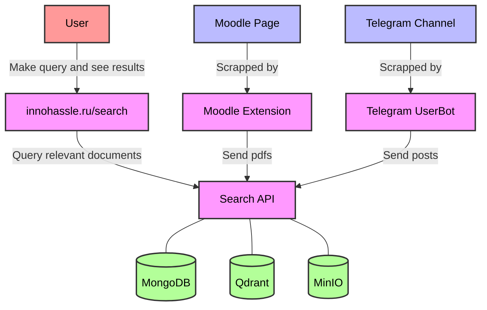
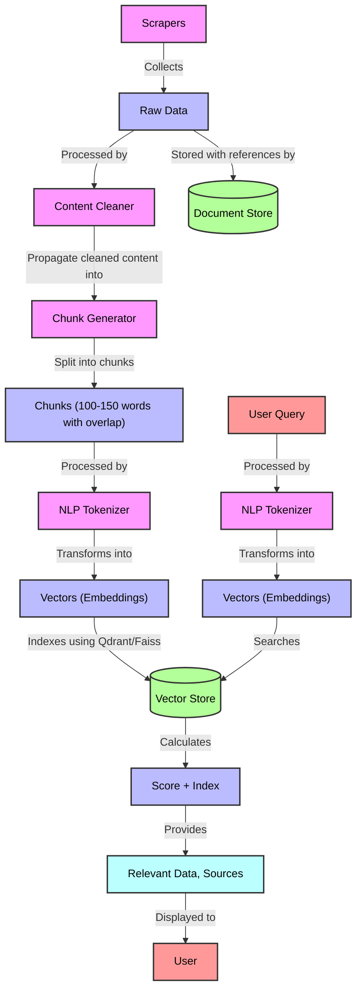

# Week 2 - Choosing the Tech Stack, Designing the Architecture

## Tech Stack Selection

**Frontend:** React, Next.js, TailwindCSS, React PDF.

**Backend:** FastAPI, MongoDB & Beanie, Qdrant | FAISS, MinIO

**ML:** Embeddings (TBD), langchain, Ollama(llama3)

## Architecture Design

### Overview Schema

### NLP Search Pipeline Schema

1. **Component Breakdown**: 
    1. **ASGI API app**. The ASGI (Asynchronous Server Gateway Interface) API application forms the core of the backend infrastructure for your project, facilitating efficient and scalable web service development tailored to handle asynchronous operations and high concurrency demands. This component's responsibilities and design are critical as it directly impacts both the performance and maintainability of the system. Technologies: FastAPI, MongoDB & Beanie, Qdrant | FAISS, MinIO. Below is a breakdown of functionality:
        - **API Endpoints:** Handle HTTP requests from the frontend and scrappers, processing them to perform actions like search queries, data retrieval, and data storage. This includes CRUD operations, authentication processes, and any other interactive functionality required by the client-side applications.
        - **Business Logic Implementation:** Encompasses the core algorithms and data processing logic that dictate how data is handled, manipulated, and provided back to the client. This is where the rules and procedures for data management and query processing are encoded.
        - **Database Interactions:** Manages all interactions with databases and data storage solutions, ensuring data integrity, efficiency in data retrieval and storage, and proper synchronization of data across different storage systems.
        - **Data Flow Management:** Coordinates the flow of data across various components of the system, such as between the API and the databases, or from the scraping tools to the storage and indexing services.
    2. **Website. [innohassle.ru](http://innohassle.ru)** The website serves as the primary interface for users to interact with the search functionalities provided by the backend. Leveraging React, Next.js, and TailwindCSS, the website is designed to be both aesthetically pleasing and highly functional.
    3. **Moodle Extension.** The browser add-on integrated within the Moodle ecosystem, providing functionalities such as:
        - **Session Persistence:** Automatically manages user sessions to maintain login states, reducing the friction of repeatedly logging in (common issue in Innopolis).
        - **Quick Access to Resources:** Direct links to frequently accessed course materials, assignments, and grades.
        - **Data Extraction:** Ability to scrape and extract documents, announcements, and other course-related materials automatically. This data can then be indexed and made searchable via your main site. Very helpful for test preparation.
        - **Integration:** Seamlessly integrate with the main site's API to upload and index new documents, facilitating real-time data synchronization and enrichment of the search database.
    4. **Telegram Bot.** Designed to scrape content or updates from specific channels or groups, which can then be fed into the system for indexing
2. **Data Management**:
    1. **Data Scrappers:** parsers to extract documents from moodle and other sources.
    2. **Data Version Control (DVC):** to track the state of datasets in terms of updating data.
    3. **Data Storage:** MongoDB for metadata, qdrant / faiss for embeddings, MinIO for files itself .
3. **User Interface (UI) Design**: 
    
    Our service is based on the existing InNoHassle ecosysystem, and therefore completely repeats its UI and integrates into it. The current solution (InNoHassle) has stood the test of time, during which we have gathered user feedback and continuously improved both the UI and UX accordingly. This iterative process has ensured that our design not only meets user needs but also enhances overall user experience.
    
    The design is developed with the primary goal of maximizing ease of interaction for users. We focus on simplicity and clarity, ensuring that the interface is intuitive and user-friendly. By adhering to these principles, we aim to provide a seamless and efficient experience for all users. The clean and straightforward design helps to minimize distractions and allows users to focus on their tasks, contributing to a more satisfying user experience overall.
    
4. **Integration and APIs**: 
    
    As a result of our meeting, we decided to use the following APIs for project implementation:
    
    - **Telegram API**: to retrieve information from the necessary Telegram channels.
    - **InNoHassle Accounts**: for user authentication in the developed product.
    - **Moodle API**: to retrieve information from courses.
    
    We will also use MongoDB, Qdrant, and MinIO databases to store the data necessary for the project implementation:
    
    - **MongoDB** will be used to store small-volume documents and internal information, such as source links, metadata, and more.
    - **Qdrant** is used for indexing documents and ensuring efficient data search.
    - **MinIO** is designed for storing large-size files.
5. **Scalability and Performance**: 
    - **React and Next.js:** Utilizing server-side rendering (SSR) and static generation features of Next.js improves the initial load time and performance of the web application, crucial for user retention and engagement. The component-based architecture of React allows for dynamic loading of content, which can adapt to varying traffic conditions by only updating what's necessary.
    - **TailwindCSS:** Since TailwindCSS is a utility-first CSS framework, it allows for significantly smaller CSS bundle sizes when purged correctly, which results in faster page render times and improved performance, especially important for mobile users.
    - **FastAPI:** Built on Starlette, FastAPI supports asynchronous request handling, which is more efficient on I/O operations, allowing your system to handle a large number of simultaneous users without blocking on network requests. This is particularly advantageous when dealing with high-latency operations like web scrapings and data fetches from external APIs.
    - **MongoDB & Beanie:** MongoDB’s horizontal scalability through sharding enables the database to handle large datasets and high throughput operations efficiently. Beanie’s asynchronous operations harness the power of Python’s async features to make non-blocking database calls, which helps in maintaining a high performance even under load.
    - **Qdrant | FAISS:** Both are designed for scalable similarity search in high-dimensional vector spaces, which is key to supporting the efficient querying of large-scale datasets in your application. These systems can scale with the data size and complexity of queries, ensuring that search functionalities remain fast and reliable.
    - **Caching:** We familiar with caching mechanisms at different levels (API responses, database queries, static content) to reduce the load on the servers and speed up the response time for frequently requested resources.
    - **Load Balancing:** We know about load balancers to distribute incoming network traffic across multiple servers, thus ensuring no single server bears too much demand.
    - **Grafana, Grafana Loki and Prometheus:** We utilize Prometheus (thanks to SNA course) for real-time monitoring and metrics collection across our services, ensuring detailed visibility into system performance. The metrics collected by Prometheus are visualized using Grafana, which provides customizable dashboards for comprehensive monitoring. This setup allows us to track performance efficiently and manage system health proactively, with integrated alerting mechanisms to detect and resolve issues promptly, ensuring our system remains scalable and responsive.
6. **Security and Privacy**:
    
    At InNoHassle, security and privacy are paramount considerations in our development and deployment processes. Our commitment to these principles ensures that user data is protected and our system remains resilient against potential threats. We have implemented **InNoHassle-Accounts** for our Identity and Access Management (IAM) pipeline, which provides robust authentication and authorization mechanisms. This system supports Innopolis SSO and Telegram Auth, ensuring seamless and secure user authentication.
    
7. **Error Handling and Resilience**:
    
    Our architecture design focuses on effective error handling and resilience to ensure system stability. We use detailed logging and real-time monitoring to quickly identify and address issues. By implementing retries and fallbacks, we gracefully handle transient failures to maintain continuous operation. *Testing updates in a staging environment on a separate server ensures that changes are thoroughly validated before deployment, minimizing potential disruptions and enhancing overall system reliability.* This approach helps us maintain a dependable user experience.
    
8. **Deployment and DevOps**:
    
    We use Trunk-based development methodology which means we have one main branch, and some short-living branches. For each branch we setup CI workflow that checks code quality, code style, runs tests (if any exist). For main branch we have CD workflow that builds a Docker image and runs project on our staging server. Then, after checking new features in staging environment, we start deployment to production workflow that pushes Docker image to our production server and reloads the project on production.
    

## Week 2 questionnaire:

1. **Tech Stack Resources:**
    
    We don’t need any project-based books as we have enough experience in our tech stack. We use only libraries documentations and some info on Internet as references.
    
2. **Mentorship Support:**
    
    We have a person who agreed to help us with ML design and general project pipeline. His name is Albert Nasybullin. As our project involves a lot of ML, his guidance on this direction is very useful to us. We believe that the advices he gives to us will lead to success of the project.
    
3. **Exploring Alternative Resources:**
    
    We invest a significant amount of time exploring various information sources, such as Habr, GitHub, Stack Overflow, and more, to analyze existing solutions, stay updated with the latest trends, and efficiently accomplish our tasks.
    
4. **Identifying Knowledge Gaps:** 
    
    Throughout our project, we continually access our current skill set and recognize areas where we lack expertise. When we identify a lack of knowledge in some area, we:
    
    - Scheduling additional mentorship sessions with Albert Nasybullin to delve deeper into advanced ML topics.
    - Engaging with communities and forums to seek advice and share knowledge with experts in these areas.
    - Reading relevant research papers and articles to stay informed about the latest advancements and best practices.
    - Viewing tutorials and training materials on relevant topics.
5. **Engaging with the Tech Community:**
    
    We are fortunate to have Albert Nasybullin, an experienced professional, guiding us on ML design and the overall project pipeline. His expertise is invaluable given our project's heavy reliance on ML. Additionally, we actively engage with fellow students and keep our project open-source, fostering a collaborative environment where we can share our progress and gather diverse feedback.
    
6. **Learning Objectives:**
    
    We aim to master asynchronous API development with FastAPI to ensure efficient and scalable web services. Additionally, we are enhancing our skills in modern frontend frameworks like React and Next.js, and creating responsive, user-friendly interfaces with TailwindCSS. In the realm of machine learning, we are focused on implementing Retrieval-Augmented Generation using Langchain and Ollama, and working with Qdrant as a vector database. Furthermore, we strive to learn full-stack integration, seamlessly connecting backend services with machine learning models to deliver a cohesive and functional solution. 
    
7. **Sharing Knowledge with Peers:** 
    
    We hold regular weekly group meetings to share knowledge and experiences with team members, as well as to address current issues. At each meeting, we discuss how we could use our skills to implement the project, and share our experiences that may help team members achieve their goals by the next meeting. Our team actively uses a Telegram group where we communicate daily, share completed work, report emerging problems, and resolve them promptly. Here, we also plan future meetings and coordinate efforts so that everyone knows what their colleagues are working on and what tasks the entire group faces.
    
    This well-structured teamwork helps us work cohesively and maintain a high level of efficiency and team cohesion.
    
8. **Leveraging AI:**
    
    We use AI. A lot of AI.
    

## Tech Stack and Team Allocation

### Team Members

| Team Member | Track | Responsibilities |
| --- | --- | --- |
| Ruslan Belkov (Lead) | ML | Backend | Research and implement NLP search pipeline | Work with storages |
| Anatoly Soldatov | ML | Research and implement NLP search pipeline |
| Eldar Mametov | Backend | Develop Telegram userbot to get channel’ post history |
| Nikita Sannikov | Backend | Develop API for Search |
| Artem Bulgakov | Frontend | DevOps | Develop browser extension to persist user session and extract data from Moodle | Deploy all services |
| Amir Gubaidullin | Frontend | Develop Search page |
| Alyona Artemeva | Frontend | Design | Develop Search page | Propose design vision |

## Weekly Progress Report

- On Monday we had a meeting with Albert Nasybullin (ML expert) regarding the architecture of ML pipeline. He proposed a way to collect data, transform data, process user request, and output information.
- On Thursday we had a meeting with Alexey Potyomkin (DoE) regarding the access to Moodle. He said that read-only access to all materials on Moodle should be no-problem. But it needs discussion with security guys and some his free time, so the access may be granted not so quick.
- Frontend team has created a web page on InNoHassle Website. The page includes basic elements that are needed for interaction with user: search input, result cards. Also, they researched solutions to preview PDF files, and integrated one of them into website.
- Extension team has created a repository for browser extension development, and researched the ways to develop extension. The basic functionality was integrated, such as Moodle API token receiving, background fetching of courses list. Extension popup with quick links to courses was also created.
- Backend team has researched ways to collect data from Telegram channels. They wrote a User bot code that fetches posts from university channels such as Opportunities for you, Sports in IU. Also, backend created a repository for Search API development, and set up CI/CD pipelines with DevOps team.
- ML team has researched ways to do RAG (retrieval augmented generation). They tried some of existing solutions to understand RAG better. Also, they prepared a pipeline to pre-process data, such as extraction of text from PDF files (it was surprisingly hard, no robust open-source solution).
- All team members were collaborating with each other, as people from other tracks have some knowledge in other tracks. Some problems were discussed in our chat, some problems required a meeting.

## Challenges & Solutions

- **Extracting Text from PDFs:** We encountered significant difficulties in extracting clean text from PDF files. We tried several libraries including pydfium, pypdf, pypdf2, unstructured, llmsherpa, and pdfplumber, but none provided satisfactory results. To address this, Ruslan decided to contribute to the pymupdf library by completely reworking the wrapper module named pdf4llm. This custom solution allowed us to achieve the clean text extraction necessary for our NLP processing pipeline.
- **Moodle API Integration:** Integrating with Moodle presented challenges due to its complex API, lack of documentation, and no fully working open-source libraries. Additionally, the authentication process was somewhat intricate. To overcome these issues, Artem researched Moodle's source code to understand how the mobile app interacts with the API, allowing us to mimic this behavior effectively and integrate the required functionalities into our system.

## Conclusions & Next Steps

### Next Steps:

1. **Refinement of ML Pipeline:**
    - Continue Developing RAG Pipeline
    - Experiment with Langchain and Ollama
2. **Enhancing Backend Functionality:**
    - Implement API Endpoints
    - Expand Telegram Integration
3. **Frontend Development Enhancements:**
    - Implement Advanced Search Features: Develop and integrate features like autocomplete, filters, and sorting options on the search page to enhance user experience.
    - Improve Browser Extension Functionality: Add features such as session persistence, real-time data extraction, and user-friendly course material navigation.
4. **Data Management and Storage Optimization:**
    - Refine Data Pipeline
    - Integrate Data Version Control (DVC)
5. **Knowledge Sharing:**
    - Continue holding weekly meetings and knowledge-sharing sessions, encouraging team members to discuss challenges, solutions, and new learnings.

Let’s keep the momentum going and make significant strides towards our project goals! Feel free to reach out with any questions or need for support.
