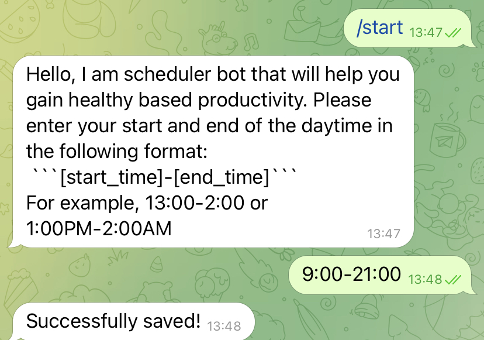
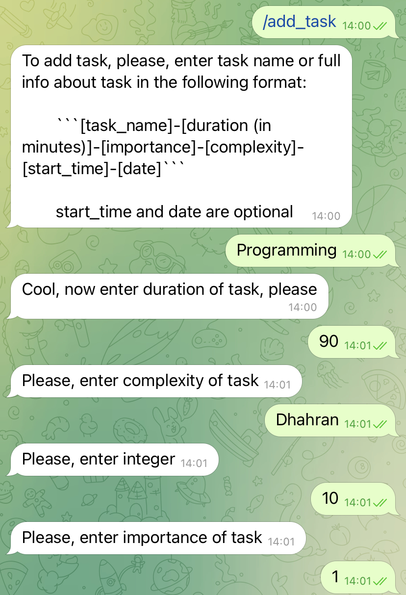
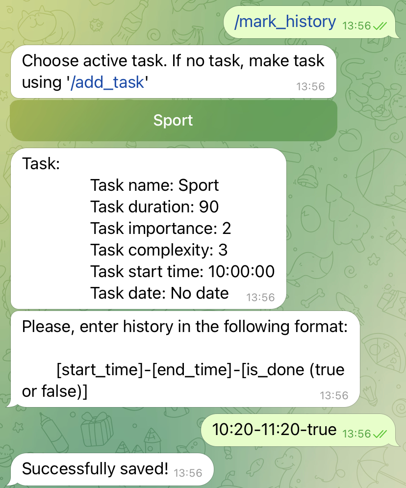
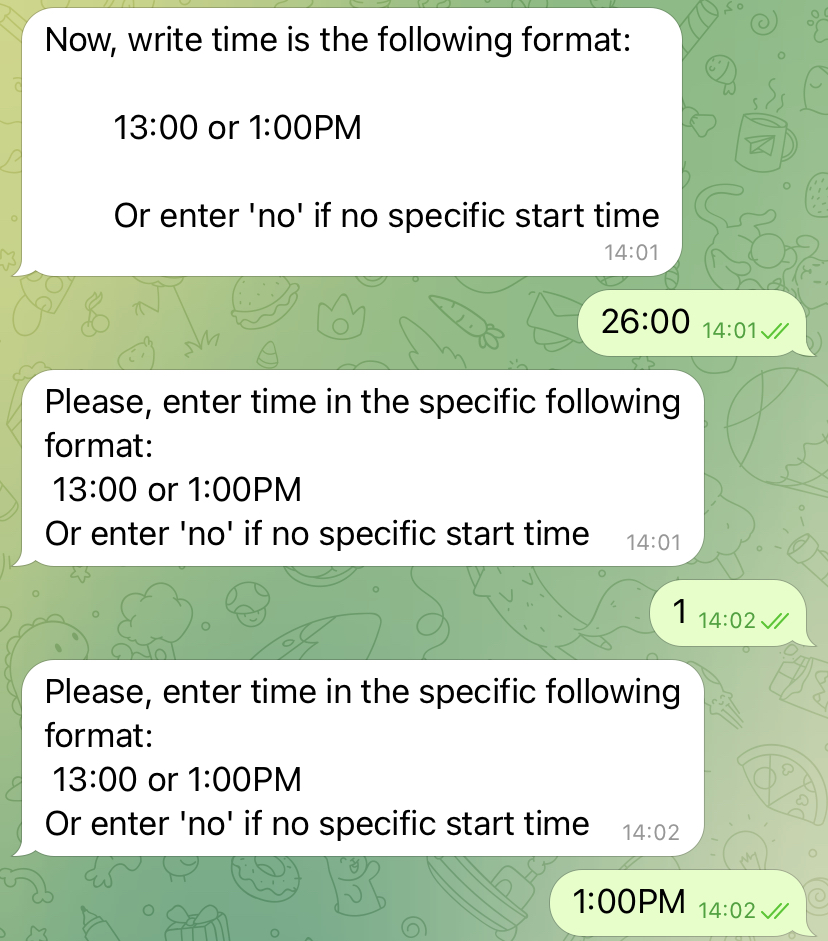

# **Introduction**



**Feedback**  
Write concise and well-written project description here. To enhance it further, we recommend incorporating additional details that provide an overview of your project. Consider including elements such as a project logo, a link to your project's webpage, or any other relevant visual materials that can help showcase your work effectively.  
As we plan to promote your work, it's crucial to ensure that this file serves as a compelling introduction that captures the attention of the potential reader. 


# **Week #1 report**
## Project: Healthy Based Productivity



**Feedback**  
Healthy Based Productivity - consider having a project name that directly tells what is it about. 


### Team members


|Team member|Telegram ID|Email Address|
| :- | :- | :- |
|Sofi Zaitseva (TeamLead)|@sofi12321|s.zaitseva@innopolis.university|
|Danila Shulepin|@Mr_Ketch|d.shulepin@innopolis.university|
|Leon Parepko|@Leon_Parepko|l.parepko@innopolis.university|
|Yaroslav Sokolov|@buiniy_yarik|ya.sokolov@innopolis.university|
|Ilnur Khadiev|@Ilnur_ha|i.khadiev@innopolis.university|

## Value Proposition 

### Identify the Problem 

Every day the pace of our life becomes increasingly fast. A great number of people often attempts to accomplish as many tasks as possible in the shortest amount of time, which can have a negative impact on their health and social relationships. This issue can even lead to burnout.
For this reason, people use planners to organize their work and personal time, however they often idealize their schedules. A schedule meticulously planned down to the minute appears highly unrealistic because it does not account for rest and transitions between tasks. Moreover, when such a plan is disrupted, it becomes a source of even more stress, irritability, lowered self-esteem, and motivation. Hence, there exists the problem of idealistic task planning by people.

### Solution Description 

Our product offers the opportunity to optimize a person's schedule based on his or her activity history.
Let's consider an example where the user systematically estimates his capabilities too optimistically and allocates less time to tasks than he or she actually spends on them. In this case, the system notes this issue and generates a more objective schedule for the day. The ability to create a schedule based on activity history is an innovation of our project.
The project implementation will be a chatbot in Telegram. In it, users will be able to work with the list of tasks - add, modify, delete, as well as mark their execution and receive the generated day schedule.



**Feedback**  
I really like your idea, I think it is clever and innovative. 


### Benefits to Users

Our project offers many benefits to users, such as
* avoiding mistakes made by people in the planning process;
* saving time, as there is no need to analyze and schedule schedules yourself;
* improved wellness due to the absence of worries about failed plans.

### Differentiation 

The main competitive advantage of our solution is its personalization. Unlike existing competitors, our project will take into account not only the user's preferences when creating a schedule, but also their work habits analyzed through activity history. Additionally, our project will be developed in the format of a Telegram chatbot that makes it simple, convenient, and likely more cost-effective compared to competitors' solutions.

### User Impact

One of the most valuable resources people have is time, some of which goes into making a schedule for the day. At the same time, plans can be idealistic, which may lead to burnout and loss of schedule value. Our project allows users to save time and nerves easily and efficiently.

### User Testimonials or Use Cases

We can take a student of Innopolis University as an example. Student
compiles a list of various tasks (personal, school, work) and then receives a schedule from the chatbot with the exact order of the tasks and the allocated time for each task.
Another example: a company distributes tasks among employees, but in order not to overload them, it takes into account the possible schedule and changes the workload and priorities

## Lean Startup Questionnaire 

1. What problem or need does your software project address?

Our project solves a problem of idealistic task planning and saving time for this process. 

2. Who are your target users or customers?
 
The target audience of our startup is people of the intellectual labor aged 18 to 60 years. They make a daily schedule, but sometimes it is unrealistic and they do not follow it. Additionally, they want to devote less time to the planning process.

3. How will you validate and test your assumptions about the project?

Our project may have both technical and user-related assumptions. First of all, we will test technical assumptions by checking the work of the system and its parts on real data and evaluate by accuracy of the built schedule. Usability will be evaluated with feedback from potential users, and the remaining user-related hypotheses will be tested through interviews with them.

4. What metrics will you use to measure the success of your project?

First of all, the output of our system should be an adequate resulting schedule, i.e. no overlapping, no shifts for fixed tasks or events (such as lectures, meetings, etc.), and adjustments based on the experience of the user's previous activity. In addition, our project will be successful if it is useful and user-friendly, so we plan to test our solution among potential users. 

5. How do you plan to iterate and pivot if necessary based on user feedback?

Primarily, we plan to analyze user feedback and extract possible changes in the system. Then we will implement the modifications, test the system on the real data and evaluate changes by user feedback. If the improvements made the system more efficient, we will accept them, otherwise our team will find another way to realize user feedback.

## Leveraging AI, Open-Source, and Experts

We will use a pre-trained NLP model for task’s names analysis, build our own ML model for scheduling, and use Chat-GPT and GitHub Copilot to help us during the working process. We also may use open-source code to make our project more efficient, and we will share our results in GitHub. Finally, we will consult with AI-lab at Innopolis University about the data collection and model building processes.

## Inviting Other Students
This project idea is a part of a startup idea that was invented before the capstone project. So several team members have already been gathered. In the last few days we have found some more teammates, that is why now our skills are enough to implement the MVP. Although we don't need more people in the team, our project is open to comments, ideas and suggestions as we want to make it cool.

## Defining the Vision for Your Project
1. Overview

In summary, our project aims to solve the problem of idealistic task planning by providing users with a personalized and optimized schedule based on their activity history. Current planners often fail to account for the rest and transitions between tasks, causing additional stress and lowered motivation when plans are disrupted.

Our chatbot in Telegram allows users to add, modify, and delete tasks while marking their completion. The innovative feature of our product is the ability to generate a more objective schedule by analyzing the user's activity history. This personalized approach sets us apart from existing competitors.

By using our solution, users can avoid the mistakes and unrealistic expectations often associated with manual planning. This saves them time and eliminates the worry of failed plans, which ultimately contributes to better well-being.

2. Schematic Drawings

General workflow of the project


3. Tech Stack

We will use Python as our programming language because it has a large number of different libraries and frameworks, which can be very useful in the development process. In addition, the Python programming community is quite large, which makes it possible to find a large amount of open source code.

We plan to use PyTorch as our main framework, as one of the most popular and scalable. 
So far, we have not fully decided which NLP model to handle task names, as well as which frameworks to write the chatbot we will use.

Our team has enough experience and qualifications to use the right tools to develop the project.

4. Anticipating Future Problems

So far, we have identified several potential future problems:
- lack of data;
- difficulties with model building and evaluating;
- how to store user’s history of activity;
- how to track the end of the task;
- how to filter the output in case of “outlier” schedule;
- user-unfriendly input.



**Feedback**  
Think of new innovative ways to generate initial data - perhaps, you can use language models to generate you fake user input to train your models? 


5. Elaborate Explanations

Our project involves building an application to create a day's schedule based on the list of tasks entered by the user. We plan to use machine learning models, which will take into account not only the current tasks, but also the user's activity history, which is an innovative solution. In addition, we will implement our project in the form of a chatbot in Telegram, which is a cheap, but also simple and elegant solution.



**Feedback**  
You have a strong team and a very good project idea. It is also clear that you have a clear vision of the project. Since this course aims to finish the semester with an MVP - minimal viable product, consider scaling your project down to creating a web app and a telegram client that does core/main things - something that you can build on and improve later. Outline main features of your project and focus on execution. I would also think about which particular parts you can strip down - for example UI can be very simple (remember, we have only 7 weeks). Put the main emphasis on the technology core that you need to showcase: the technology that takes user input and create a schedule.  



# **Week #2**

### **Tech Stack Selection**

We will use Python as our programming language because it has a large number of different libraries and frameworks, which can be very useful in the development process. In addition, the Python programming community is quite large, which makes it possible to find a large amount of open source code.

We plan to use PyTorch as our main framework, as one of the most popular and scalable. Also, we will use Aiogram as API to communicate with Telegram bot, and OpenAI library to generate tasks names in natural language that people can add in their schedule. We will manage a database using postgresql and sqlalchemy libraries. Also, we plan to use sklearn, pandas and matplotlib for data preprocessing and filtering.

Our team has enough experience and qualifications to use the chosen tools to develop the project.


### **Architecture Design**

1. **Component Breakdown**: Main components of our software solution are:
+ *Telegram bot*. This is a medium between the user and main system. It deals with tasks and events - users can add, edit, delete them and look at the list of current tasks. Also, telegram bot shows the generated schedule and marks the completed tasks. So, it plays the role of user interface.
+ *Task name classifier*. It allows us to encode task names written in natural language (that were obtained by Telegram bot) into a vector of numbers, i.e. to perform embedding. In addition, we use the OpenAI library to generate a dataset of tasks.
+ *Schedule prediction*. The function of this module is to create a schedule for the tasks given by the user. The coded task name from Task name classifier, and other information about this task received by the telegram bot are fed to the input of the model. The result is a schedule on a given day.


2. **Data Management**: User info will be stored in sql databases. We will manage a database using postgresql and sqlalchemy python libraries. Model info will be stored in separate files and mapped by database to the user.

3. **User Interface (UI) Design**: 
We are creating a Telegram bot that is a User Interface by itself. Here one can look at the functions that we plan to implement.

```

> `/start` -> starting point of using bot

Bot will ask time when it is allowed to set a task

Format:

> [**start_time**]-[**end_time**]

Could be either in 24h format or 12h format

Example:

> `13:00-2:00`

or 

> `11:00AM-2:00PM`


> `/add_task` -> adds task according to info in specific format or according to questionnaire

Specific format could be:

> [**task_name**]-[**duration** (in minutes)]-[**importance**]-[**complexity**]-[start_time]-[date]

(start_time and date are optional)

Example

> `Sport-90-3-1-9:00-1/1/1970`

```


**Week 2 Feedback by Rustam**  
Embed PDF is a function that embeds PDF files only, you can create a PDF from your md files and embed them again, here. I've copied some parts of the UI design from the .md file and pasted them as a codeblock


5. **Integration and APIs**: We will use the telegram bot API. We will get info from the user and handle the message based on the functions discussed in UI.

6. **Scalability and Performance**: For MVP we are assuming that only one user will use the system. However, for the future we are looking to make the bot asynchronous and copy models for each user. Also, our database may handle multiple users at a time.

7. **Security and Privacy**: Since we communicate through telegram bot, API and security measures are in-built, and we do not have to provide security on this side. The sql libraries provide basic security, and for MVP that is enough. After the successful testing of MVP we will develop more advanced security. 

8. **Error Handling and Resilience**: 
Logging: 
  - Each function should have a debug log.
Error handling: 
  - Bot will check a message to be appropriate for the current state. If not, just send an error message to the user.

8. **Deployment and DevOps**: To make a robust development workflow, we will add mandatory pull request checks by another member of the development team.

## **Week 2 questionnaire:**  

1) Tech Stack Resources: No, we don’t use any books. We are in search of state-of-art models, so we are using mainly articles and papers.

2) Mentorship Support: Currently, we don’t have any mentors. However, we have people who agree to help and consult us in terms of model development, including Rustam Lukmanov and Vladimir Ivanov.

3) Exploring Alternative Resources: We search articles and papers on ResearchGate, Elsevier, arxiv, etc. Documentation of frameworks and libraries we are supposed to use: TensorFlow, PyTorch, OpenAI, Aiogram, etc. To learn more about creating an asynchronous Telegram bot we will use a course on Stepik.

4) Identifying Knowledge Gaps: 

We have some knowledge gaps regarding creating an asynchronous telegram bot. To close this gap, our bot developer will take a course on creating asynchronous bots. 

In addition, we have not much experience in finding appropriate models, so we consult with professionals in the field of AI and study articles on that topic.

5) Engaging with the Tech Community: We use StackOverflow to ask questions and solve problems related to our tech stack.

6) Learning Objectives: For this week, we set a goal of finding data generation methods and a suitable model architecture for scheduling. To do this, we use articles describing state-of-the-art techniques. In addition, we ask chatGPT questions under the condition to refer to the sources. 

7) Sharing Knowledge with Peers: Our team communicates via a group chat in Telegram, where we share all the information and ideas related to the project and the tech stack. In addition, we have a shared repository on GitHub and shared Google Docs for writing reports.

8) Leveraged AI: We ask chatGPT questions under the condition to refer to the sources.


### **Tech Stack and Team Allocation**

1) *Telegram bot*. This is a medium between the user and main system. It deals with tasks and events - users can add, edit, delete them and look at the list of current tasks. Also, telegram bot shows the generated schedule and marks the completed tasks. So, it plays the role of user interface and will be implemented by Aiogram. The responsible person is Ilnur Khadiev.
2) *Database*. This is a storage for the data given by the user. The responsible person is Ilnur Khadiev.
3) *Task name classifier and data generation*. It allows us to encode task names written in natural language (that were obtained by Telegram bot) into a vector of numbers, i.e. to perform embedding. In addition, we use the OpenAI library to generate a dataset of tasks. The responsible person is Danila Shulepin. His task is to generate data, find a relevant pretrained NLP model and train it using Keras or PyTorch.
4) *Schedule data generation*. Since the analyzed open source datasets turned out to be irrelevant, we decided to use Chat-GPT to generate data through OpenAI library. After mentioning all the necessary schedule properties, we got the relevant dataset for the initial training of the main model. The responsible person is Yaroslav Sokolov. The task is to properly generate the data.
5) *Pre- and postprocessing filters*. These are linear mapping algorithms that would be written from scratch. First filter cleans up data and ensures that only relevant data is fed into the neural network, while the second is used for result estimation. If the result is not good enough, the neural network would regenerate it. This ensures that the model produces accurate results. We plan to use sklearn, pandas and matplotlib. The responsible person is Sofi Zaitseva.
6) *Schedule Neural Network*. The neural network is the core of the proposed model. There are many known and used architectures, so we would try different approaches, mainly recurrent neural networks, and choose the best-fitting one. The realization will be implemented using PyTorch. The responsible person is Leon Parepko.

The principles underlying the proposed model are based on generalizing an average person's schedule and finding specific patterns of planning tasks. The model aims to personalize the scheduler for each user by analyzing their scheduling patterns and preferences.




**Feedback week 2 by Rustam**  

I think your project is progressing nicely and I am glad to see the first functions already implemented. So now, team is on the same page regarding the overall project and every team member knows his responsibilities - it's time to focus on implementing the project.   
Ramp up the pace, add some features and I am sure this project will be taking shape very soon. 

Overall, 5/5   
Good work




# **Week #3**

## **This week priority list:**

1. Choose the architecture of the main model;
2. Create an account for Telegram chat-bot;
3. Add functions add_task, add_event, mark_history in chat-bot;
4. Generate sample tasks for each of the 5 labels: Work-study, Physical activity, Food, Daily Routine and Passive rest;
5. Build, train, and test a pre-trained NLP model to classify task names;
6. Generate basic data to build a schedule;
7. Basic data preprocessing;
8. Implement core data parsing of user input.

## **Progress report**:  

 - **Prototype Features**

The core of our project is the Main Model that finds the most suitable time for each task. We had several ideas about the architecture of this model, and in the end we chose the two best ones, which we will probe in practice. This week we started implementation of a complex neural network that includes LSTM cells with ANN mapping. However, this is time consuming work.

To train the model we need a big amount of data. We decided to generate this data, because there are no open-source datasets. Also, this data will be retrieved from the user, and we as potential users may implement it by ourselves. 

Also, each task will have its name that should be properly encoded. We decided to group all tasks in 4 groups: Sport, Passive Rest, Work-Study, Daily Routine. To map the input task name in a number of the group we used a pretrained NLP model. To complete its learning we generated possible tasks names for each group using OpenAI generative transformers. 

In addition, we created an entity-relationship diagram for the database, which will be implemented next week.


 - **User Interface**

Interaction with the user works through the Telegram bot @Innoplan_bot. This week, we have developed the basic functions of start (image 1), adding an event (image 2), a task (image 3), and a history of task execution (image 4). 

We have implemented the basic skeleton of each activity, i.e. you can enter all the data in a line (image 2) or item by item (image 3). We have also implemented basic message processing - for example, if the user entered the time in the wrong format, he or she will be asked to repeat the input in the right format (image 5).

 




 - **Challenges and Solutions**

This week we experienced several challenges.

First of all, choosing the main model architecture was difficult. We had a lot of ideas, and in the end we chose the two best ones, which we will probe in practice.

The big challenge was to design an optimal gpt request for task name generation. The solution resulted in a large number of attempts to improve the requests and finally we made it!

It was also important to make the schedule more generic. We solved this issue by adding randomness in the task runtime and duration, breaks and offsets.

- **Next week priority list:**
1. Finalize the first version of the main model;
2. Train and test the main model;
3. Create database;
4. Implement parsing to available time slots;
5. Combine chat-bot, data preprocessing and main model together;
6. Add buttons to the user interface.

---
