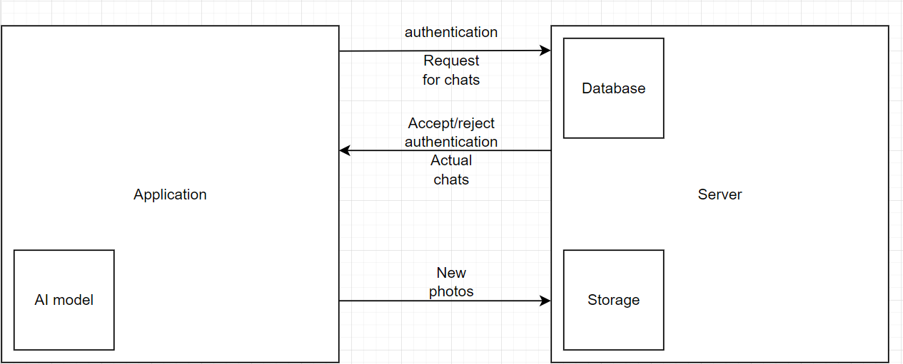

# Week 1 #

## Team Formation and Project Proposal ##

To create the application, our team contains ML-engineers for creating ML-model to identify mushrooms and
Flutter-developers who will create the mobile application.

### Team members ###

| Team Member      | Telegram ID       | Email Address                     |
|------------------|-------------------|-----------------------------------|
| Timofey Didenko  | @n1ce_timothy     | t.didenko@innopolis.university    |
| Artyom Makarov   | @smulemun         | a.makarov@innopolis.university    |
| Damir Abdulayev  | @SpeedFireF       | d.abdulayev@innopolis.university  |
| Danil Kuchukov   | @xFonzie          | d.kuchukov@innopolis.university   |
| Almaz Dautov     | @hir0t            | a.dautov@innopolis.university     |
| Gleb Statkevich  | @glebkkevich      | g.statkevich@innopolis.university |
| Elmir Vadigullin | @Elmir_Vadigullin | e.vadigullin@innopolis.university |

---

### Value Proposition ###

Our app solves the problem of identifying the type of mushroom by using photo and location data. It is a common issue
for mushroom hunters, farmers, and even ordinary people to accurately identify the types of mushrooms they come across.
Our app provides a unique solution to this issue by using AI to recognize the type of mushroom from photo and location
data. Our app is unique because it provides accurate and reliable identification of mushrooms, which is not available in
existing alternatives.

- Identifying the Problem: Many people make mistakes while collecting mushrooms, which can lead to poisoning and even
  death. In Russia alone, mushrooms poison thousands of people each year.
- Solution Description: Our app will identify the type of mushroom and indicate whether it is safe to eat or not.
- Benefits to Users: Our app enhances the safety of mushroom hunters and farmers by providing accurate identification of
  mushrooms. It also helps people to learn about different types of mushrooms and avoid consuming poisonous ones. Our
  app is user-friendly and provides a seamless experience to users.
- Differentiation: We conducted research on existing alternatives and found that they all have disadvantages that our
  app will overcome. For example, "Picture
  Mushroom" ([Google Play](https://play.google.com/store/apps/details?id=com.glority.picturemushroom&hl=en&gl=US),
  [App Store](https://apps.apple.com/us/app/picture-mushroom-fungi-finder/id1474578078)) cannot identify non-mushroom
  objects in photos, requires an internet connection, and is expensive. "Mushroom identificator"
  ([App Store](https://apps.apple.com/us/app/mushroom-identificator/id1227854971)) often incorrectly identifies
  mushrooms, and "Shroomify"
  ([Google Play](https://play.google.com/store/apps/details?id=com.mushroom.shroomify&hl=en&gl=US),
  [App Store](https://apps.apple.com/ca/app/shroomify-canada-mushroom-id/id1490594715)) only provides identification for
  certain locations. Our app will provide accurate identification offline and will be affordable.
- User Impact: Our app will have a positive impact on the safety of mushroom hunters, farmers, and ordinary people. It
  will also promote awareness about different types of mushrooms and their characteristics.
- User Testimonials or Use Cases:
  [In 2017](https://www.latimes.com/local/lanow/la-me-ln-mushroom-sickness-20170602-htmlstory.html)several a toxic
  mushroom poisoned people in California because they did not have an app to identify it. Our app will help all
  people, from professional mushroom pickers to beginners. We will also organize events to help professionals share
  their experiences with others in local areas.

---

## Lean Startup Methodology ##

Our software project addresses the problem of identifying the type of mushroom by using a photo and location data.

Our target users are mushroom hunters, farmers, and ordinary people who come across mushrooms and want to identify them.
We will also consider occasional mushroom pickers and beginners.

Before creating a dataset for training our AI model, we will consult with mushroom specialists to determine what
information we need to collect. We will also share our results with our mentor for feedback. Before developing the app,
our designer will create detailed designs, which we will use to make improvements.

We will ask users to test new features and use their feedback to decide what to do next. We will also ask our friends
and relatives to collect mushrooms and test the app.

---

## Leveraging AI, Open-Source, and Experts ##

We will conduct our own research to find the best CNN-model for identifying mushrooms. We will also use a second model
to analyze location data. These two models will form our AI model.

We have not found any open-source projects or experts that can help us at this time.

## Defining the Vision for Your Project ##

- Overview: Our app uses AI to identify the type of mushroom using photo and location data. Users can take a photo of
  the mushroom and provide location data, and our app will provide an accurate identification of the mushroom.
- Schematic Drawings: Our app consists of a user interface, an AI algorithm for mushroom identification, and a database
  of mushroom types. The user interface allows users to take a photo and provide location data. The AI algorithm
  processes the photo and location data to identify the type of mushroom. The database provides information about
  different types of mushrooms.
- Tech Stack: Our app uses Python for the AI algorithm, Flutter for the user interface, and Postgresql for the database.
- Anticipating Future Problems: We anticipate potential problems related to the accuracy of identification and user
  engagement. We will mitigate these problems by improving the AI algorithm and user interface.
- Elaborate Explanations: Our AI algorithm uses computer vision and machine learning to identify the type of mushroom
  from a photo. It analyzes the shape, color, and texture of the mushroom to provide an accurate identification. The
  database provides information about different types of mushrooms, including their characteristics and toxicity levels.
  Our app is unique because it provides accurate and reliable identification of mushrooms even offline, which is not
  available in existing alternatives.

Here's how the structure of the project will look like:


**Feedback**

**Value Proposition**

Good stating for the problem. But
> Our app stands out from competing solutions because

How did you know that you stand out? Did you make any market research?

Uses cases stated are not correct. You need to give details how your product will be used and by whom exactly.

**Lean startup question**

The whole section very short, and you didn’t spent much time considering answering.
How will you act on the feedback, how will you iterate on it?

**AI**

What AI algorithm will you use?

**Vision Of The Project**
Missing Schematic Drawings

**Overall**

The report is weak. And I think it was made very fast. Without much consideration.

2.5/5

_Feedback by Moofiy_
