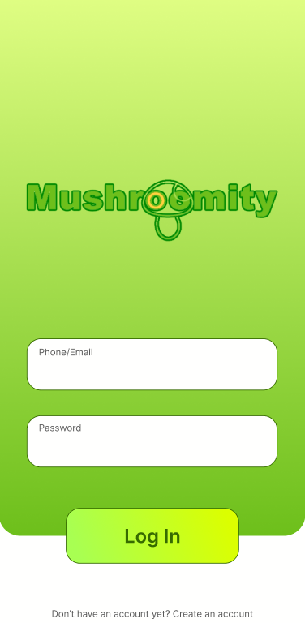
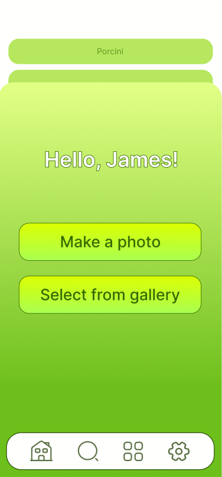
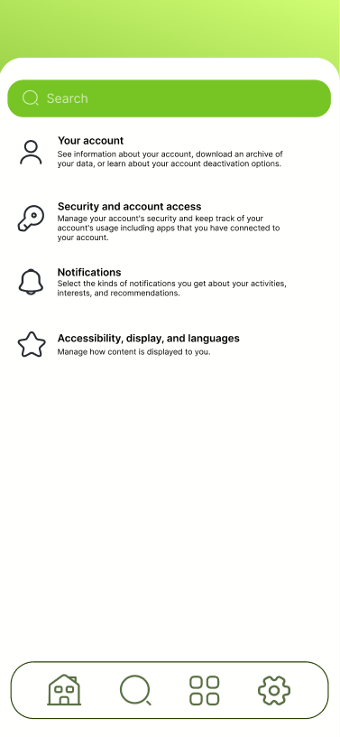

# Week 3 #

This week we started creating design and . We created the first UI-design of main pages, parsed a site for
getting photos of mushrooms and started to create a back-end system of the app.

## Developing the first prototype, creating the priority list ## 

Due to we only started to make something this week, we don't have a nice that users can try to use. Fortunately, we
created a small front-end system containing some main functions of the projects.

- Technical Infrastructure: To be prepared, we only need from everyone to know how to work with their tech stack and
  some GPUs for training our model:
  - The first 2 weeks our main developers (Gleb and Elmir) reminded Flutter, and for today they are ready to create
    everything our app needs to. They've already started creating app, all details are lower.
  - Right now we don't need GPUs for training our model because we don't have the model:) But own GPUs are prepared and
    just waiting.
  - In total, our team has already created all stuff for working together (organization, repositories and projects for
    them).
- Backend Development: Later
- Frontend Development:
  - When you open the app, you firstly have to log in or sign
    in:

    
  - After that, you go to the main page, where you can go to other pages or analyze mushroom by
    photo:

    
  - After taking a photo, you go to the page with this photo and description of mushroom in
    it:

    

    The description might be changed, now it's just an example.
  - Of course, you may want to change language or log out. For that, you may go to the settings
    page:

    
  - In addition, in the app you will also be able to chat with other people about any topics you want by using
    forum:

    
- Data Management: To fast collect lots of photos, we create a script that parses sites about mushrooms and stores all
  photos on the drive. Drive contains packages, which describes a type of mushroom (for example - "agrocybe"). Inside
  these packages there are some packages that describe subtypes of the mushroom (for example - "agrocybe arvalis").
  Right now we parsed [only one site](http://photo.gribnoymir.ru/), and we're working on some others to extend our
  dataset. We did not start work on sending users' photos to our server; thus, there will be explanation about this
  technique later.
- Prototype Testing: Later

In total, we have a small prototype with nice front-end, but bad back-end. Next week we will continue to create the
application and dataset and finish with the first version of the model.
